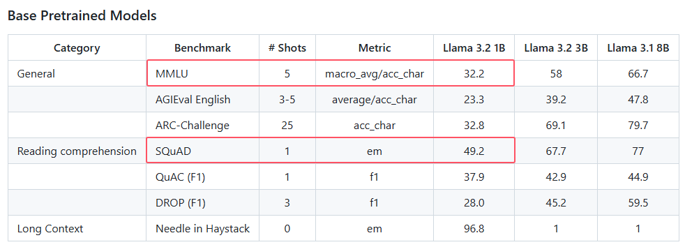
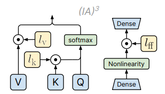
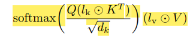
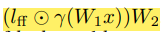
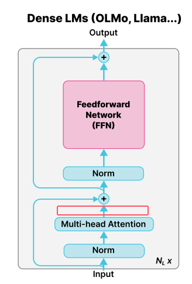

# 复现

复现**llama3.2 1B**在MMLU和SQuAD上的结果

# 实现Lora微调和(IA)$^3$微调

预期达到更好的效果

# (IA)$^3$+

## QK-Norm

1、RMS Norm
$$
\bold{y}=\frac{\bold x}{\sqrt{\sum_{i=1}^Dx_i^2}} \odot \bold{g}\\
注意\bold{g}是一个可学习的向量
$$
2、$(IA)^3$指的是在K、V和FFN中间的激活层输出后逐元素乘一个可学习的向量，分别记为$l_k,l_v,l_{ff}$

测试时同Lora一样，可以结合$l$和$W$，即$l\odot Wx=(l\odot W)x$

3、然而$(l_k\odot K^T)$后直接与Q做矩阵乘法容易出现较大的logits，从而导致数值溢出和不稳定。

解决方案是
$$
softmax(\frac{Norm(Q)Norm(l_k\odot K^T)}{\sqrt{d_k}})(l_v\odot V)
$$
4、因为QK-Norm增加的参数也只是一个向量$\bold{g}$，所以PEFT可训练参数量的数量级不变。（实际上QK-Norm是OLMOE中直接使用的技巧，我这里只是把它和IA3绑定了，因为IA3要逐元素乘一个向量，可能更容易发生数值溢出）

## 对attention层的输出也逐元素乘上一个向量

1、设multi-head attention的输出为O。

则我们可以尝试再增加一个向量$l_O$。令$O'=O\odot l_o$，即$O'_{i,j}=(l_o)_j O_{i,j}$

2、测试时同Lora一样，可以结合$W_O$和$l_o$，即$l_o\odot W_ox=(l_o\odot W_o)x$

3、可训练参数量仍然和IA3一样，在同一数量级