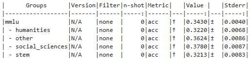

# MMLU

## base model

`unsloth/Llama-3.2-1B-bnb-4bit`

## LoRA

## IA3

## Our Method

## Our Method wo o_proj

# arc_challenge

## base model

## LoRA

## IA3

## Our Method

## Our Method wo o_proj

